# Title

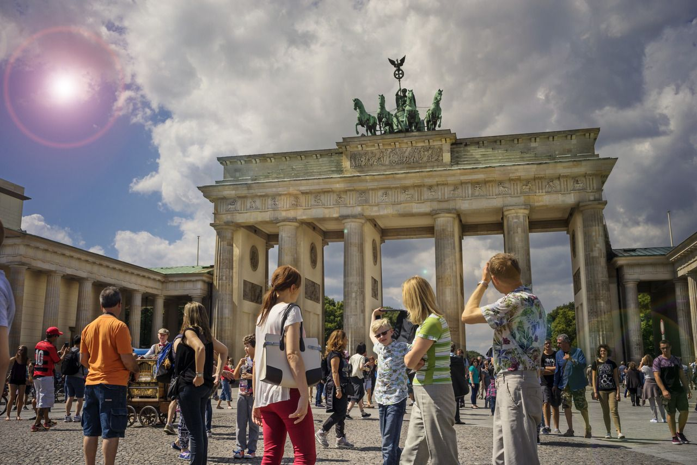

Berlin, the German capital, is renowned for its wide variety of attractions, its diverse cultural scene and infinite possibilities that excite visitors every single day in the year. Almost 13 million visitors travelled to Berlin in 2017. They spent 31.1 million nights in booked accommodation. Whether you want to host exciting visitors from all around the world or you just want to spent a couple of days in this amazing city, there are interestings facts for you.

The neighbourhood with more Airbnb offerings is Neukölln with 3539 different accomodations registered in April this year. It is followed by Prenzlauer Berg, Friedrichshain and Kreuzberg, all popular bohemiam neighboorhoods. 

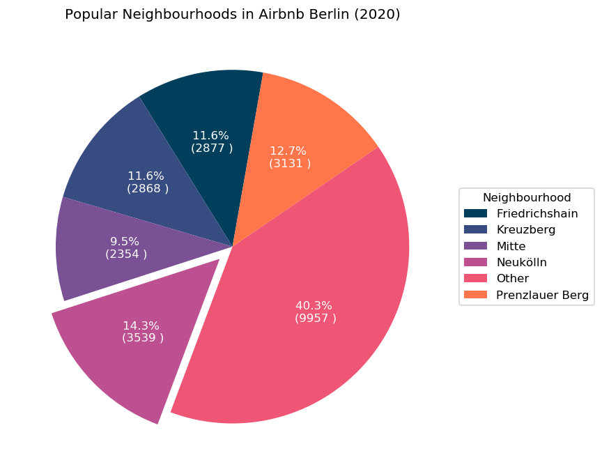

Neukölln's enormous potential cannot be described without mentioning the challenges that the district faces. In no other Berlin district do so many ethnic groups come together so closely; nowhere else in Berlin there is such a cultural diversity. However, what has long been interpreted as a weakness of Neukölln is increasingly turning out to be strength. The population' s diversity is also expressed in a high level of acceptance for change. The mega-district Neukölln is about to establish itself as a young, impulse-giving and powerful engine in Berlin. In Neukölln you can't watch - you have to keep up. Developments are rapid and not gradual. And unlike before, no new parallel societies are developing, but a young, hungry business culture, from which the established population of Neukölln does not want to be protected, but to profit. Many people recognize the signs and understand that it is not about displacement, but about change. Investors plan coworking spaces and build the necessary apartments for people moving in. Orphaned parking garages are turned into offices, and game halls into functioning retail, catering, office or service structures. The vision for Neukölln is not a protected milieu, but a cosmopolitan, dynamic, real participating community.

* https://guthmann.estate/en/market-report/berlin/neukolln/

Shown below are the top 5 **most** and **less** expensive neighbourhoods by listing price in average.

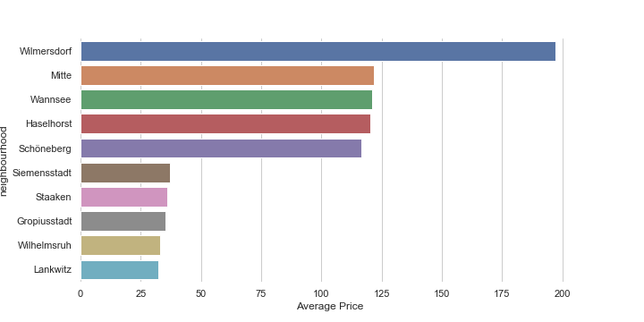

Wilmersdorf is an elegant, bourgeois district without any smugness. The exclusive, partly a bit conservative character is definitely appreciated by the residents. Exclusive quarters can be found in the Grunewald districts, urban neighbourhoods in turn in the inner-city locations of the district. In the 1920s, many artists and intellectuals moved to Wilmersdorf. An attractive and lively downtown with cafés and theatres grew up in the west of Berlin. The noble Grunewald quarter was not far away and was an excellent location for the Berlin Bohemians. The Nazis put an abrupt end to the cultural heyday in Wilmersdorf and many Wilmersdorfers were forced into exile for political reasons or because of their Jewish origins. Today, important scientific and cultural institutions and agencies are located in Wilmersdorf. Numerous galleries are located here, as well as the Schaubühne am Lehniner Platz. Some embassies in Grunewald and Schmargendorf are located in the immediate vicinity of the private residences of their ambassadors.

* https://guthmann.estate/en/market-report/berlin/wilmersdorf/

Over the years, Airbnb prices has increased a lot. 

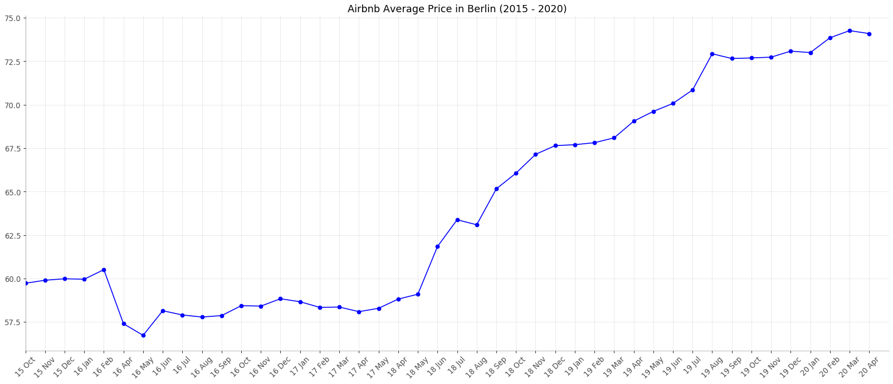

Airbnb prices in Berlin increases 19%, while the housing index has increased 30% in the same period. Renting index has increased 33% for existings buildings and 45.20% for new buildings in the last five years. It shows that Airbnb prices increases slowly compared to housing/renting indexes.

Sources: 
* https://tradingeconomics.com/germany/housing-index
* https://guthmann.estate/en/market-report/berlin/#rent

The most popular accomodations are entire apartements, which cover more than 88% of all Airbnb listings in Berlin.

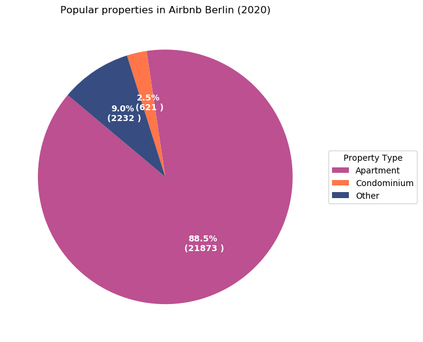

## Kickoff Questions
1. How do space aspacts influence final review scoring and price ? 
2. How do amenities impact in the final review score of each listing ?  
3. How did prices evolve over time?

## How do space aspacts influence final review scoring and price ? 

Below is the correlation between aspects of accomadation with overall review score and price.

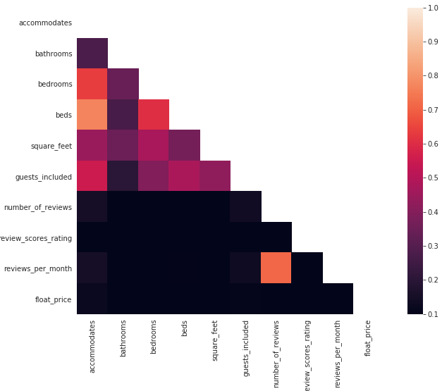

When we look at `float price` and `review_scores_rating` we see that those have very low correlation with everything else. We conclude that price and review score are not heavily influenced by space aspects.

## How do amenities impact in the final review score of each listing ?

Following are the questions I will explore in this section
1. How do prices vary per neigborhood ?
2. What neighborhood has the most expensive listings ?
3. What does differ a expensive listing to a cheap listing in terms of amenities? What are the most popular amenities?

Shown below are the amenities present in more than 50% of listings in the 10 more expensive neighbourhoods

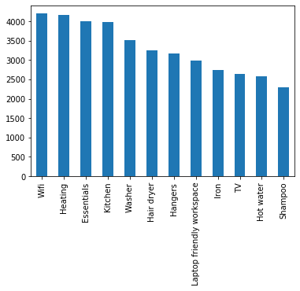

Shown below are the amenities present in more than 50% of listings in the 10 less expensive neighbourhoods

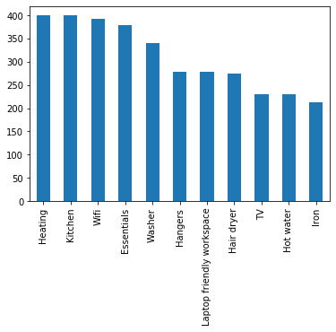

Amenities do not have huge impact on price. Nevertheless, there is a set of essential things you **MUST** have in your accomdation.

## How did prices evolve over time?  

**Note:** Data from previous months/year is required

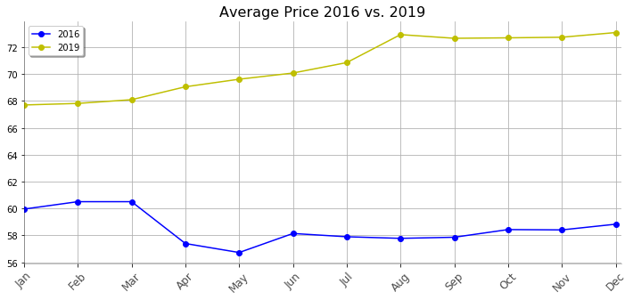

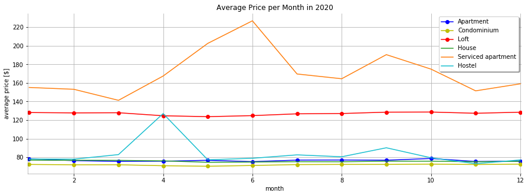

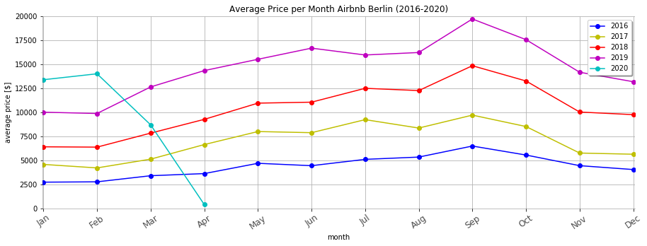

We can see that 2020 had a drastic impact because of COVID-19

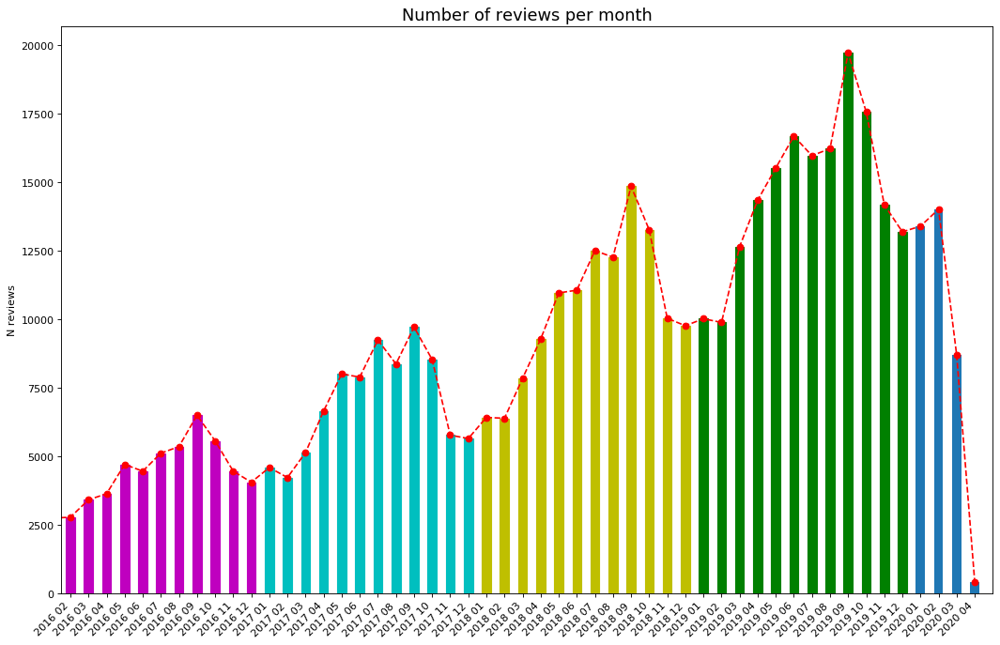

We can observe spikes during the summer, in July, August, September every year. We can also observe a steady increasing in number of reviews per each year, that reveals that increase in Airbnb adoption in Berlin.
