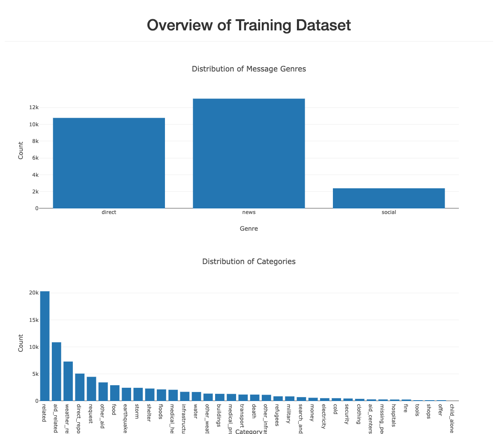
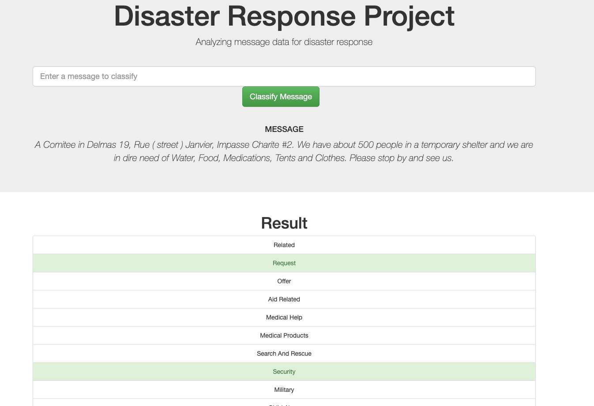

# Disaster Response Pipeline Project

## Overview

In this project I've built a etl/ml pipeline to analyze a dataset that contains real messages sent during disaster events. 

## Components

### ETL Pipeline

Loads data from csv files and cleans the data. See [process_data.py](https://github.com/vitorarrais/data-science-notebooks/blob/master/disaster-response/data/process_data.py)

### ML Pipeline

Apply various NLP algorithms for feature engineering and builds a classifier that categorizes unseen messages. See [train_classifier.py](https://github.com/vitorarrais/data-science-notebooks/blob/master/disaster-response/models/train_classifier.py)

### Web App

A Flask application where the user can put messages to be categorized and then display the results. See [app/](https://github.com/vitorarrais/data-science-notebooks/tree/master/disaster-response/app)

### UI

## Running
1. Run the following commands in the project's root directory to set up your database and model.

    - To run ETL pipeline that cleans data and stores in database
        `python data/process_data.py data/disaster_messages.csv data/disaster_categories.csv data/DisasterResponse.db`
    - To run ML pipeline that trains classifier and saves
        `python models/train_classifier.py data/DisasterResponse.db models/classifier.pkl`

2. Run the following command in the app's directory to run your web app.
    `python run.py`

3. Go to http://0.0.0.0:3001/

## Acknowledgment

Dataset was curated and given by [Flight Eight](https://appen.com/datasets/combined-disaster-response-data/)